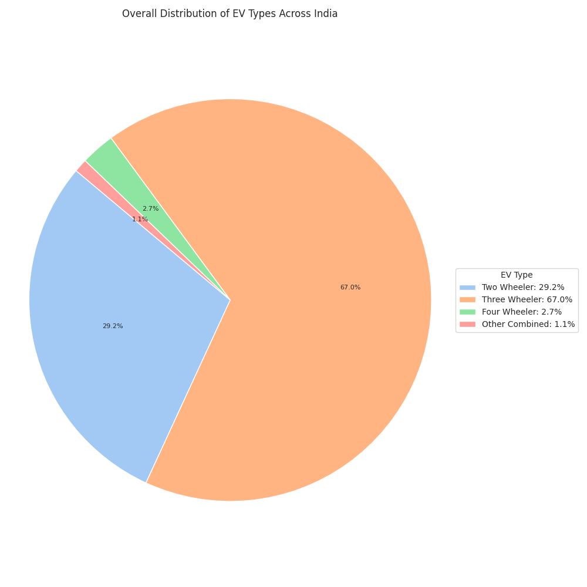
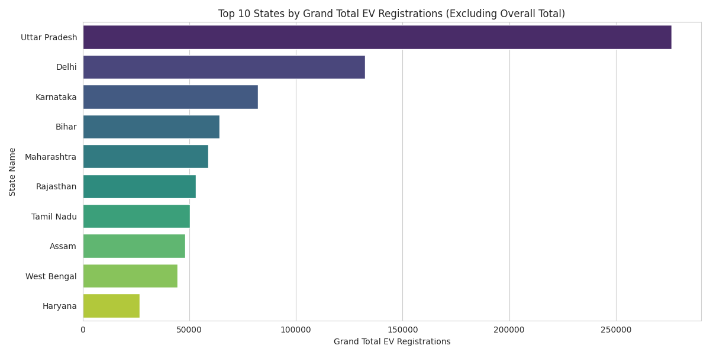
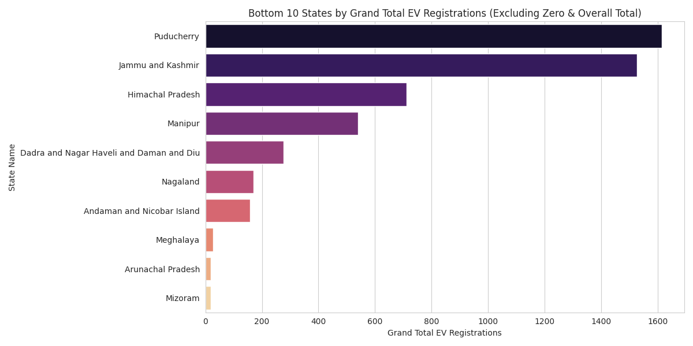
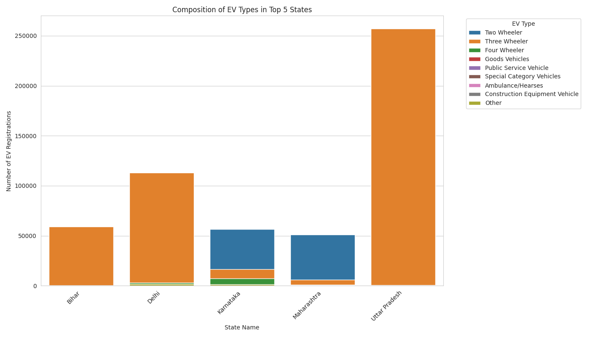

# EV-Market-Segmentation-in-India-A-Geographic-Analysis
Electric Vehicle (EV) market segmentation analysis focused on geographical distribution across various states in India.

# READ ME

# EV Market Segmentation in India: A Geographic Analysis

## 1. Introduction
This report details an Electric Vehicle (EV) market segmentation analysis focused on geographical distribution across various states in India. The primary objective is to understand the current landscape of EV adoption, identify leading and lagging regions, and provide actionable insights for companies operating within or looking to enter the Indian EV market.

## 2. Dataset Overview
The analysis is based on a dataset containing EV registrations across different categories for various Indian states and union territories.
* **File Name**: `ev_data.csv` (downloaded via `gdown` from Google Drive)
* **Key Columns**: `State Name`, `Two Wheeler`, `Three Wheeler`, `Four Wheeler`, `Goods Vehicles`, `Public Service Vehicle`, `Special Category Vehicles`, `Ambulance/Hearses`, `Construction Equipment Vehicle`, `Other`, `Grand Total`.

## 3. Process Explanation
The segmentation process involved data loading, cleaning, exploratory data analysis, and visualization using Python in Google Colab.
* **Libraries Used**: `pandas`, `numpy`, `matplotlib.pyplot`, `seaborn` (imported in respective cells).
* **Methodology**:
  1. **Data Loading**: Downloaded CSV from Google Drive using `gdown`.
  2. **Data Cleaning**: Filled NaN values with 0, converted numerical columns to integers.
  3. **EDA**: Filtered out ‘Grand Total’ row, ranked states by EV registrations, analyzed EV type distributions.
  4. **Segmentation**: Used `State Name` for geographic segmentation.
  5. **Visualization**: Generated bar and pie charts to visualize findings.

## 4. Graphs and Visualizations (with Interpretations)
### a. Overall Distribution of EV Types Across India

* **Interpretation**: Three Wheelers dominate (~60%), followed by Two Wheelers, indicating strong commercial and personal mobility adoption. Four Wheelers are a smaller segment, suggesting slower uptake due to cost or infrastructure barriers.

### b. Top 10 States by Grand Total EV Registrations

* **Interpretation**: Uttar Pradesh leads significantly, followed by Delhi, Karnataka, Bihar, and Maharashtra, highlighting key markets with mature EV ecosystems.

### c. Bottom 10 States by Grand Total EV Registrations

* **Interpretation**: States like Arunachal Pradesh and Mizoram show minimal adoption, indicating infrastructure or awareness barriers but potential for future growth.

### d. Composition of EV Types in Top 5 States

* **Interpretation**: Uttar Pradesh and Bihar are driven by Three Wheelers, while Delhi, Karnataka, and Maharashtra show more diversified adoption, including Two and Four Wheelers.

## 5. Conclusion
The EV market in India shows significant geographical disparities, with Uttar Pradesh leading, driven by Three Wheelers. North-Eastern states lag, offering growth opportunities. Two and Three Wheelers dominate nationally, with Four Wheelers growing slowly.

## 6. Solution to the Company
* **Prioritize High-Potential States**: Focus on Uttar Pradesh, Delhi, Karnataka, Bihar, Maharashtra with tailored products (e.g., Three Wheelers for Uttar Pradesh, Two/Four Wheelers for Delhi).
* **Tap Untapped Markets**: Launch pilot programs in low-adoption states like Arunachal Pradesh.
* **Product Development**: Innovate in Two/Three-Wheeler segments, invest in affordable Four Wheelers.
* **Infrastructure**: Partner for charging networks to reduce range anxiety.
* **Marketing**: Use state-specific campaigns highlighting cost savings and incentives.
